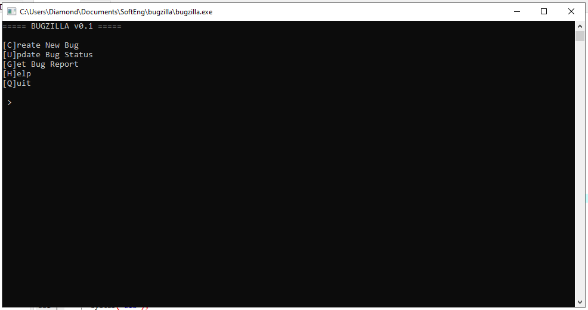
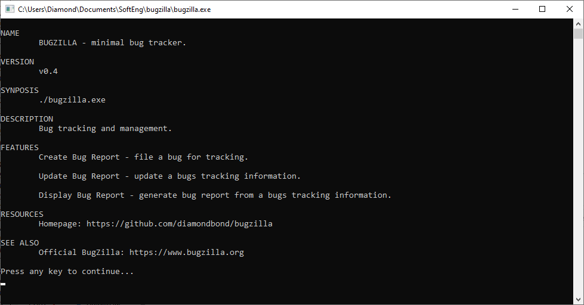

# bugzilla
Bug report tracker.





## Description
Minimalistic bug report tracker and management system.

## Installation
Windows: See [Releases](https://github.com/DiamondBond/bugzilla/releases)

Linux: See [Install from source](#install-from-source)

## Install from source
Windows:
- Install [Dev-C++](https://sourceforge.net/projects/orwelldevcpp)
- Download this repo as a zip file
- Unzip somewhere
- Open bugzilla.cpp with Dev-C++
- Press F11 to compile & run

Linux:
```
git clone https://github.com/diamondbond/bugzilla
make all
# or `make release` if you want to build without -Ofast
```

## Usage
Windows: Double click the executable (bugzilla.exe)

Linux: 
```
./bugzilla.o
```

## Features
### Platform agnostic
Runs on Windows & POSIX compliant systems.
### Create a bug report
Creates a bug and files it for tracking.
### Update a bug report
Updates a bugs tracking information.
### Display a bug report
Generates a bug report from a bugs tracking information.
### List bug reports
Lists available bug reports.

## Inspiration
https://www.bugzilla.org
